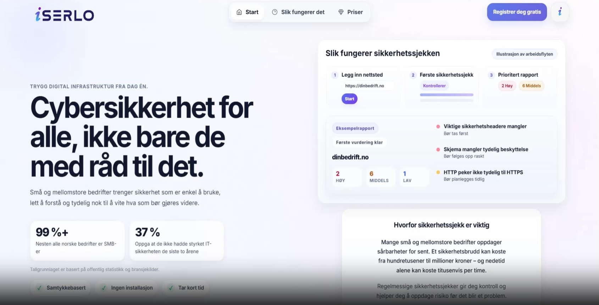
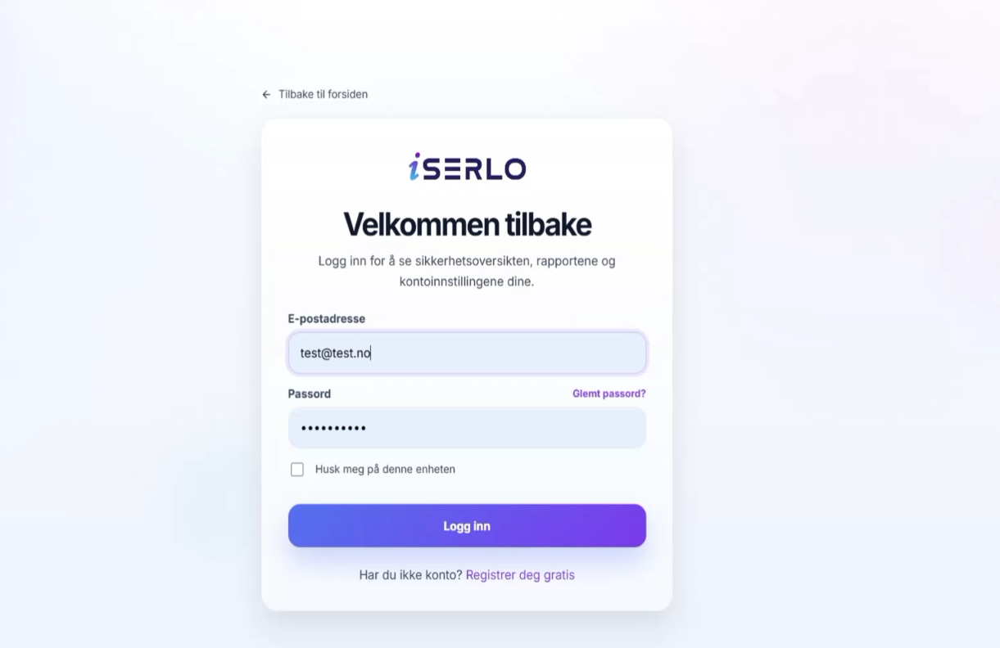
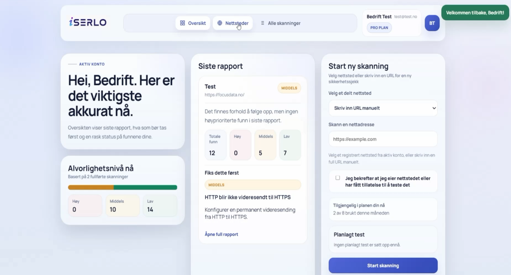
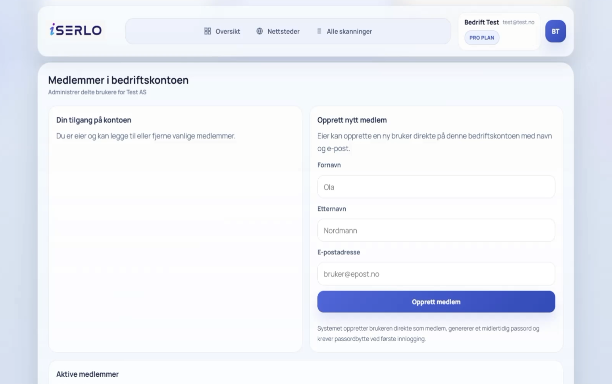
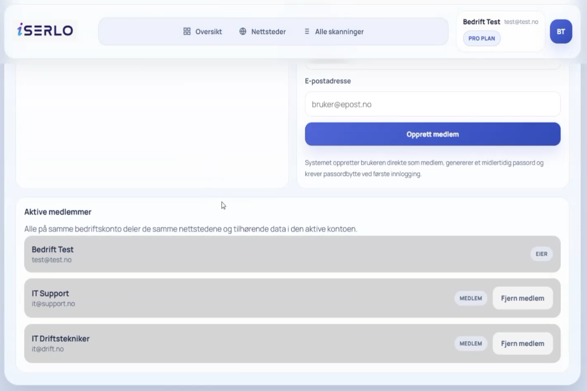
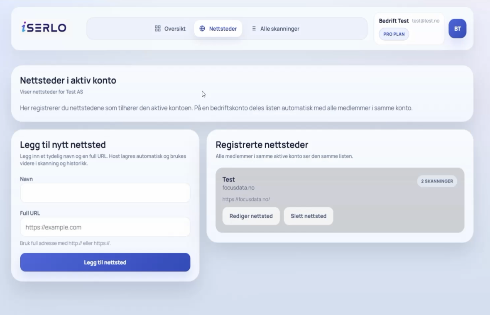
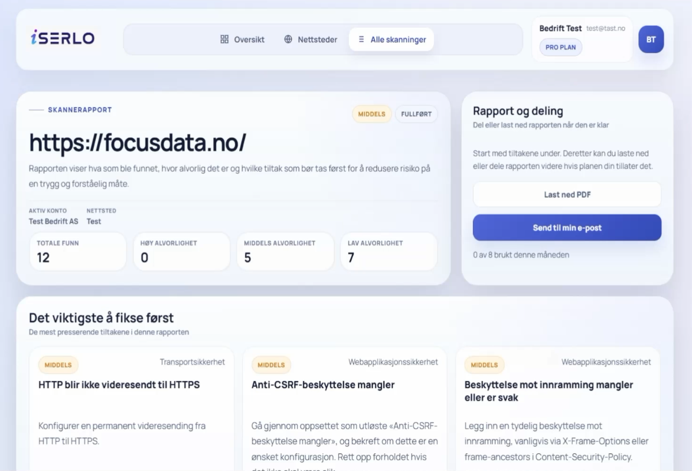
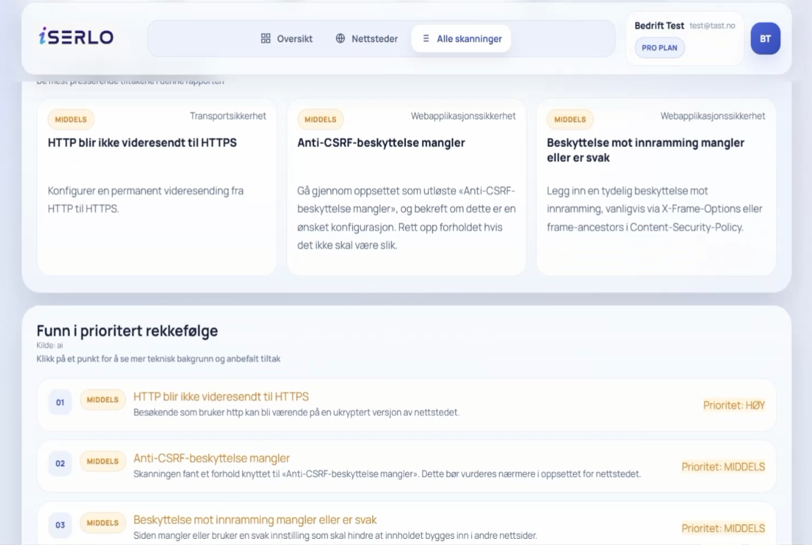
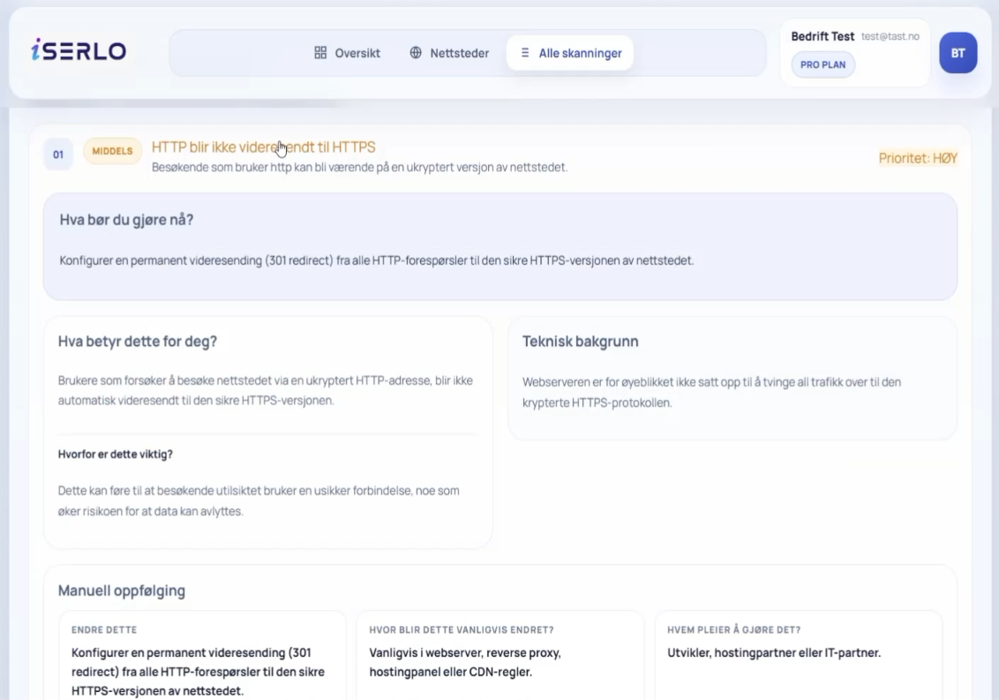

# iSerlo Web Protector

Bachelorprosjekt i cybersikkerhet ved Kristiania, våren 2026. Vi var fem studenter som utviklet en webbasert prototype for oppdragsgiveren iSerlo.

Målet var å gjøre det enklere for små og mellomstore bedrifter å undersøke sikkerheten på egne nettsider og forstå resultatene. Brukeren kan registrere et nettsted, starte en sikkerhetssjekk og få en rapport med funn, forklaringer og forslag til tiltak.

Dette repoet dokumenterer prosjektet gjennom ni skjermbilder. Det inneholder ikke kildekoden til plattformen.

## Mitt bidrag

Jeg jobbet selvstendig med innlogging, brukerregistrering, betalingsside og databasearbeid. Jeg laget tabeller og relasjoner og koblet disse delene sammen. Underveis feilsøkte og løste jeg problemer der data ikke ble oppdatert riktig på tvers av tabeller.

Jeg bidro også til rapportfunksjonalitet og andre deler av løsningen sammen med gruppen. I tillegg dokumenterte jeg eget arbeid skriftlig og presenterte det for oppdragsgiveren. Skjermbildene nedenfor viser gruppens samlede løsning.

## Teknologi

- **PHP og Laravel 11:** Backend, innlogging, validering og applikasjonslogikk.
- **Laravel Blade:** Sider og brukergrensesnitt.
- **MySQL og Eloquent:** Lagring og relasjoner mellom brukere, kontoer, nettsteder og skanneresultater.
- **OWASP ZAP API:** Integrasjon med skannemotoren.
- **Laravel-køer:** Bakgrunnsjobber for skanning og rapportutsending.
- **Stripe Checkout:** Betalingsflyt for Pro i testmodus.
- **Mailpit:** Lokal testing av e-post.

## Gjennomgang av løsningen

### 1. Forsiden

Forsiden forklarer hvem løsningen er laget for og hvordan en sikkerhetssjekk foregår: registrere et nettsted, kjøre en sjekk og lese en prioritert rapport. Brukeren kan gå videre til registrering eller lese om tjenesten og prisene.

Rapporten på høyre side er en illustrasjon av arbeidsflyten. Den viser hvordan funn kan deles inn etter alvorlighetsgrad og presenteres med korte forklaringer.

### 2. Innlogging

Her logger brukeren inn med e-postadresse og passord. Siden har også valg for å huske innloggingen, tilbakestille passord og opprette en ny konto. Bildet viser innloggingsskjemaet med en testkonto før innlogging.

Innlogging og registrering var blant delene jeg jobbet selvstendig med, sammen med koblingen til databasen.

### 3. Oversikten etter innlogging

Dashboardet samler siste rapport, alvorlighetsnivå fra tidligere skanninger og skjemaet for å starte en ny skanning. I bildet har kontoen Pro-plan, og siste rapport viser 12 funn: 0 med høy, 5 med middels og 7 med lav alvorlighetsgrad. Oversikten til venstre summerer funn fra to fullførte skanninger.

Til høyre kan brukeren velge et registrert nettsted eller skrive inn en URL. Før skanningen startes, må brukeren bekrefte at vedkommende eier nettstedet eller har tillatelse til å teste det. Siden viser også forbruk av skanninger og status for planlagt test.

### 4. Opprettelse av medlemmer i bedriftskontoen

En bedriftskonto kan brukes av flere personer. På denne siden kan kontoeieren opprette et medlem med fornavn, etternavn og e-postadresse.

Grensesnittet forklarer at systemet oppretter et midlertidig passord og krever passordbytte ved første innlogging. Det viser også at eieren har rettighet til å legge til og fjerne vanlige medlemmer.

### 5. Oversikt over aktive medlemmer

Videre på samme side vises medlemmene som er knyttet til bedriftskontoen. Bildet viser én eier og to vanlige medlemmer. Eieren har knapper for å fjerne medlemmer fra kontoen.

Medlemmene deler nettstedene og tilhørende data i den aktive bedriftskontoen. Dette gjør at flere personer kan følge opp de samme nettstedene og rapportene.

### 6. Registrering og administrasjon av nettsteder

Her legger brukeren til et nettsted med navn og full URL. Registrerte nettsteder vises i listen til høyre, med mulighet for redigering og sletting. I eksemplet er ett nettsted registrert med to tilknyttede skanninger.

Nettstedene tilhører den aktive kontoen. Medlemmer av samme bedriftskonto ser derfor den samme listen og kan bruke den videre i skanning og historikk.

### 7. Rapport fra en fullført skanning

Rapportsiden viser hvilket nettsted som ble undersøkt, hvilken konto rapporten tilhører og at skanningen er fullført. Funnene er oppsummert etter alvorlighetsgrad. Under oppsummeringen vises tiltakene som rapporten anbefaler å følge opp først.

Til høyre finnes valg for å laste ned rapporten som PDF eller sende den til brukerens e-post. Disse funksjonene er styrt av abonnementet. Rapporten bygger på lagrede skanneresultater, slik at den kan åpnes og deles uten å kjøre skanningen på nytt.

### 8. Funn i prioritert rekkefølge

Lenger ned i rapporten vises hvert funn med en kort forklaring, alvorlighetsgrad og anbefalt prioritet. Eksemplene i bildet gjelder HTTP-videresending, mulig manglende CSRF-beskyttelse og beskyttelse mot innramming av nettsiden.

Alvorlighetsgrad og prioritet vises hver for seg. I eksemplet er manglende videresending til HTTPS merket med middels alvorlighetsgrad, men høy prioritet for oppfølging. Brukeren kan klikke på et funn for å lese mer. Automatiske funn må vurderes før de behandles som bekreftede sårbarheter.

### 9. Detaljert forklaring og forslag til tiltak

Her er funnet om manglende videresending fra HTTP til HTTPS åpnet. Rapporten forklarer hva observasjonen betyr, hvorfor den er relevant og hvilket tiltak som foreslås. I dette eksemplet anbefales en permanent 301-videresending til HTTPS.

Under manuell oppfølging beskrives også hvor endringen vanligvis gjøres, for eksempel i webserver, reverse proxy eller hostingpanel, og hvem som normalt følger den opp. Tanken var at rapporten skulle gi brukeren noe konkret å ta videre til en utvikler eller IT-leverandør.

## Testing og avgrensninger

Gruppen testet blant annet registrering, innlogging, kontotilgang, registrering av nettsteder, skanning, rapportvisning, PDF-eksport og e-post. Bachelorrapporten oppgir 173 beståtte automatiserte tester og 1 184 assertions i den siste testkjøringen. Dette var supplert med manuell testing i nettleseren.

Passiv skanning var standardflyten. Ifølge bachelorrapporten ble nettstedet i skjermbildene undersøkt med eierens tillatelse, begrenset til passive observasjoner. Aktiv skanning ble prøvd i et kontrollert DVWA-labmiljø og var ikke aktivert som en vanlig brukerfunksjon.

Løsningen var en bachelorprototype, ikke en ferdig produksjonstjeneste. Betalingsflyten brukte Stripe i testmodus, og planlagte skanninger og Premium-funksjoner var ikke like grundig verifisert som hovedflyten. Brukerens bekreftelse på tillatelse var heller ikke en teknisk verifisering av eierskap til nettstedet.

Funnene i bildene er resultater fra prosjektets testing, ikke en vurdering av nettstedets sikkerhet i dag. Automatiserte skanninger kan gi feilaktige eller ufullstendige funn og erstatter ikke en full sikkerhetsvurdering.

## Hva jeg lærte

Jeg fikk særlig erfaring med hvordan innlogging, betaling og database må fungere sammen i en større applikasjon. Arbeidet med tabeller og relasjoner lærte meg å følge data gjennom flere deler av løsningen og feilsøke når oppdateringer ikke fungerte som forventet.

Prosjektet ga meg også erfaring med å utvikle i et team, dokumentere teknisk arbeid og forklare fremdrift og løsninger for en ekstern oppdragsgiver.
